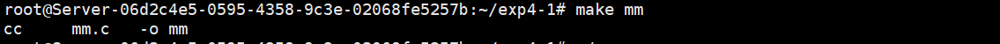
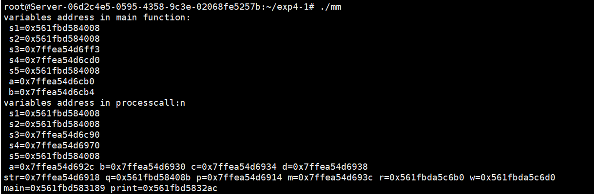

<center><b><span style='font-size:60px;font-family:微软雅黑;'>实验报告</span></b></center>


 

<center><b><span style='font-size:35px;font-family:微软雅黑;'>题目：观察进程虚拟地址空间内的变量和数据分布<u></u></span></b></center>

<center><b><span style='font-size:20px;font-family:微软雅黑;'>科目：操作系统课程设计<u></u></span></b></center>

<center><b><span style='font-size:20px;font-family:微软雅黑;'>班级：<u>2020211322/2020211314</u></span></b></center>

<center><b><span style='font-size:20px;font-family:微软雅黑;'>学号：<u>2020211280/2020211274/2020211278/2020211253</u></span></b></center>

<center><b><span style='font-size:20px;font-family:微软雅黑;'>专业：<u>数据科学与大数据技术/网络工程</u></span></b></center>

<center><b><span style='font-size:20px;font-family:微软雅黑;'>姓名：<u>蓝恒志/邓宇求/霍雨博/许嘉烨</u></span></b></center>

<center><b><span style='font-size:20px;font-family:微软雅黑;'>学院：<u>计算机学院</u></span></b></center>

<center><b><span style='font-size:14px;font-family:微软雅黑;'>2023年 4 月 5 日</u></span></b></center>				


 <div STYLE="page-break-after: always"><div>

[TOC]

## 一、实验目的

- 了解Linux进程虚拟地址空间的组成


## 二、实验内容

- 编写C语言程序，分配位于堆和栈上的变量，观察变量的地址分布和变化


## 三、实验环境和准备

1、**实验环境**

- Linux version 5.15.0-60-generic

- Ubuntu 22.04.1

- vim编辑器

- gcc (Ubuntu 11.3.0-1ubuntu1~22.04) 11.3.0

  


## 四、实验步骤及实验分析

> 若要完成内存地址的对比以及查看，我们需要分别在主函数和调用的函数中设置不同区域的变量。经过修改后的示例代码如下：

```C
#include<stdio.h>
#include <malloc.h>

void print(char *,int);
int main()
{
    char *s1 = "abcde";
//"abcde"作为字符串常量存储在常量区 s1、s2、s5拥有相同的地址
    char *s2 = "abcde";
    char s3[] = "abcd";
    long int *s4[100];
    char *s5 = "abcde";
    int a = 5;
    int b =6;   //a,b在栈上，&a>&b地址反向增长

    printf("variables address in main function: \ns1=%p\n   s2=%p\n s3=%p\n s4=%p\n s5=%p\n a=%p\n b=%p \n",
           s1,s2,s3,s4,s5,&a,&b);
    printf("variables address in processcall:n");
    print("ddddddddd",5);
//参数入栈从右至左进行,p先进栈,str后进 &p>&str
    printf("main=%p print=%p \n",main,print);
    //打印代码段中主函数和子函数的地址，编译时先编译的地址低，后编译的地址高main<print
}

void print(char *str,int p)
{
    char *s1 = "abcde";  //abcde在常量区，s1在栈上
    char *s2 = "abcde";  //abcde在常量区，s2在栈上
    // s2-s1=6可能等于0，编译器优化了相同的常量，只在内存保存一份
    //而&s1>&s2
    char s3[] = "abcdeee";//abcdeee在常量区，s3在栈上，数组保存的内容为abcdeee的一份拷贝
    long int *s4[100];
    char *s5 = "abcde";
    int a = 5;
    int b =6;
    int c;
    int d;    //a,b,c,d均在栈上，&a>&b>&c>&d地址反向增长
    char *q=str;
    int m=p;
    char *r=(char *)malloc(1);
    char *w=(char *)malloc(1) ;  // r<w 堆正向增长

    printf("\ns1=%p \n s2=%p \n s3=%p\n s4=%p\n s5=%p\n a=%p b=%p c=%p d=%p \nstr=%p q=%p p=%p m=%p r=%p w=%p \n",
           s1,s2,s3,s4,s5,&a,&b,&c,&d,&str,q,&p,&m,r,w);
    /* 栈和堆是在程序运行时候动态分配的，局部变量均在栈上分配。
    栈是反向增长的，地址递减；malloc等分配的内存空间在堆空间。堆是正向增长的，地址递增。
    r,w变量在栈上(则&r>&w)，r,w所指内容在堆中(即r<w)。*/
}

```

> 将代码编译后运行，截图如下：





> 可以观察到：不论是在`main`还是`processcall`中，`s1`、`s2`和`s5`都是相同的，这是因为他们的值都是`"abcde"`的首地址，而常量`"abcde"`存放在常量区，因此相比在栈上的`s3`，地址有较大差距。而`s4`也同样在栈中，且对于`main`中的`s3`,`s4`，差值为323，而`processall`中的则为320，差值为3，正好与两个函数中s3的字符差相同。
>
> 可以看到a,b,c,d都在栈中，地址分别相差4（int所占字节数）。main中的a、b同理
>
> 对于`processall`中传入的参数`"ddddddddd"`，虽然作为字符常量，其地址应该在常量区，但由于传入了函数，被重新拷贝了一份放入栈中，因此地址也在栈中。
>
> 而对于r，w，栈是反向增长的，地址递减；malloc等分配的内存空间在堆空间。堆是正向增长的，地址递增。因此w>r。
>
> 对于函数，编译时先编译的地址低，后编译的地址高，因此main<print。

## 五、总结体会

本次实验就变量、函数的地址进行了探讨、观察，帮助我更深一步地理解了地址的分配方式。本次实验我收获丰富。

