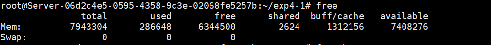
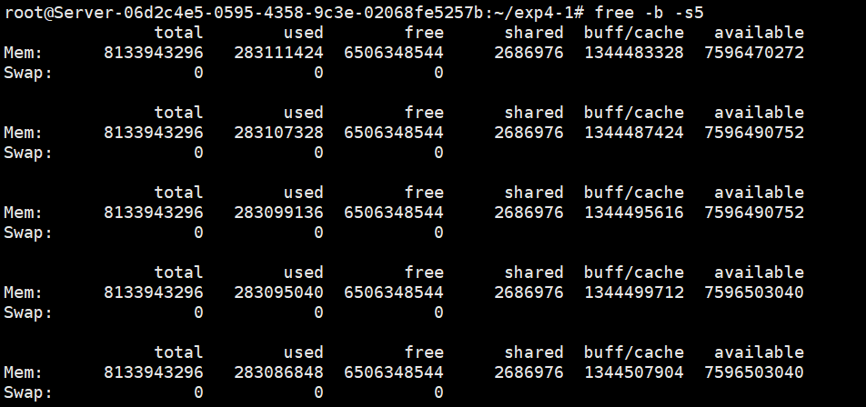
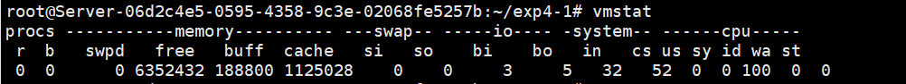
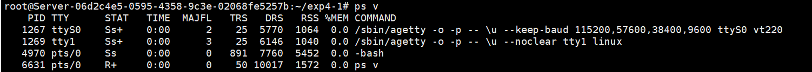
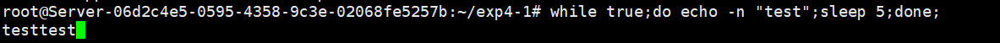
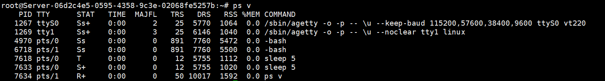
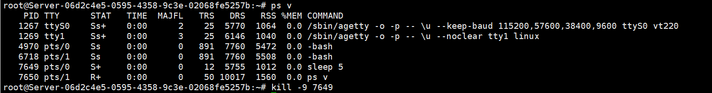
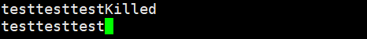

<center><b><span style='font-size:60px;font-family:微软雅黑;'>实验报告</span></b></center>


 

<center><b><span style='font-size:35px;font-family:微软雅黑;'>题目：内存监控检查回收<u></u></span></b></center>

<center><b><span style='font-size:20px;font-family:微软雅黑;'>科目：操作系统课程设计<u></u></span></b></center>

<center><b><span style='font-size:20px;font-family:微软雅黑;'>班级：<u>2020211322/2020211314</u></span></b></center>

<center><b><span style='font-size:20px;font-family:微软雅黑;'>学号：<u>2020211280/2020211274/2020211278/2020211253</u></span></b></center>

<center><b><span style='font-size:20px;font-family:微软雅黑;'>专业：<u>数据科学与大数据技术/网络工程</u></span></b></center>

<center><b><span style='font-size:20px;font-family:微软雅黑;'>姓名：<u>蓝恒志/邓宇求/霍雨博/许嘉烨</u></span></b></center>

<center><b><span style='font-size:20px;font-family:微软雅黑;'>学院：<u>计算机学院</u></span></b></center>

<center><b><span style='font-size:14px;font-family:微软雅黑;'>2023年 4 月 10 日</u></span></b></center>				


 <div STYLE="page-break-after: always"><div>

[TOC]

## 一、实验目的

- 1、掌握查看实时监控内存、内存回收的方法。
- 2、进一步掌握虚拟存储器的实现方法。


## 二、实验内容

- 1.用free 命令监控内存使用情况:

  \# free

  \# free-b-s5

  用 vmstat 命令监视虛拟内存使用情况。
  ＃ vmstat

- 2．检查和回收内容:
  用命令 ps列出所有正在运行的程序名称、对应的进程号(PID)等信息。
  ＃ ps v
  用kill 命令回收泄漏的内存。

  \# kill - 9 < PID>


## 三、实验环境和准备

1、**实验环境**

- Linux version 5.15.0-60-generic

- Ubuntu 22.04.1

  


## 四、实验步骤及实验分析

> - #### 使用`free`命令

```
free
free -b -s5
```





> -b代表以字节数进行存储量的表示（默认以1024字节为一个单位）
>
> -s5代表每五秒显示一次

| 参数名称   | 解释                   |
| ---------- | ---------------------- |
| total      | 共有的可用内存         |
| used       | 被使用的内存总额       |
| free       | 全部空闲的内存         |
| shared     | 多个进程共享的内存总额 |
| buff/cache | 磁盘缓存的当前大小     |
| available  | 可用的内存总额         |

> - #### 使用`vmstat`



> 主要报告了活动进程、内存、交换分区、来自块设备的输入输出量、系统中断、以及中央处理单元分配给用户、系统和空闲时分别占用的比例。

> - 使用`ps`指令



> 为了验证`kill`指令，新建一个进程：



> 启用另一个终端，使用`ps v`指令



> 使用`kill`指令






> 可以发现，进程确实是被kill了，但是被`kill`的是`sleep 5`语句，因此`test`还在继续输出
>
> 至此实验结束。


## 五、总结体会

这次实验中，我通过使用`ps`，`vmstat`，`kill`，`free`指令，实现了对内存的监控、回收。这次实验对于我更进一步理解linux 的内存机制有很大的帮助，帮助了我掌握查看实时监控内存、内存回收的方法。

